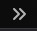
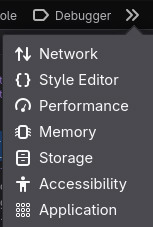
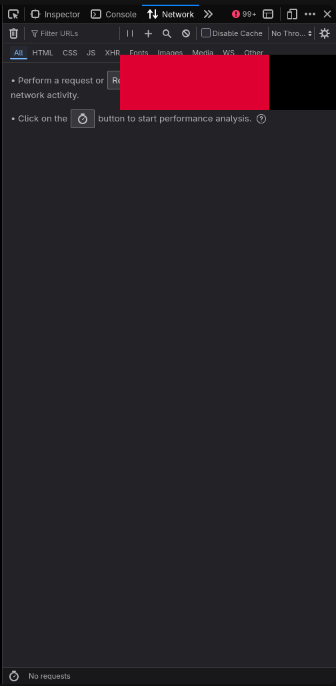
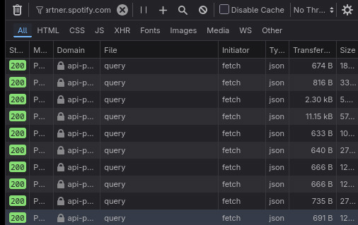
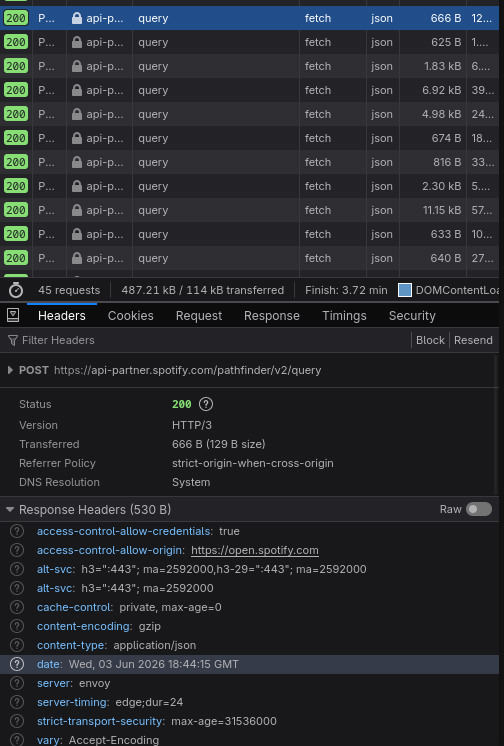
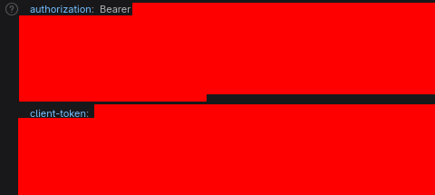

# AddiFy

A high-performance C++ utility designed to rapidly clone and inject an entire artist's discography into your designated Spotify playlist.

---

## ⚠️ Terms of Service Notice & Disclaimer

This tool interacts with internal/undocumented endpoints and technically violates the Spotify Terms of Service (ToS). 

* **Risk:** While ban history for consumer-level tools like this is historically virtually non-existent, executing unauthorized API calls always carries an inherent risk.
* **Liability:** If your account is flagged, restricted, or banned due to aggressive endpoint spamming or malicious abuse of this utility, **I take absolutely no responsibility.** Use this software at your own risk.

---

## 🛠️ Building the Project

### Prerequisites
Ensure you have a C++20 compliant compiler, `libcurl`, and `yaml-cpp` installed on your system.

### Option 1: Automatic Build (Recommended)
A `Makefile` is included for convenience. Run the following commands:
```sh
git clone [https://github.com/watchmypizza/AddiFy.git](https://github.com/watchmypizza/AddiFy.git)
cd AddiFy
make
```

### Option 2: Manual Compilation

If you prefer to compile manually without make, use g++:

```sh
git clone [https://github.com/watchmypizza/AddiFy.git](https://github.com/watchmypizza/AddiFy.git)
cd AddiFy
g++ Classes/*.cpp -o AddiFy -lcurl -lyaml-cpp -I/usr/include -std=c++20
```

## ⚙️ Configuration Guide

Before running the application, you must configure the `config.yaml` file located in the same directory as the executable.

### The config.yaml Template

```yaml
authorization-bearer: ""
client-token: ""

artist: ""
playlist-to-add-to: ""
```

### Step 1: Extract Credentials (authorization-bearer & client-token)

1. To authentic your requests, you need to extract temporary tokens from a live browser session.

2. Navigate to the [Spotify Web Player](https://open.spotify.com/) and log in.

3. Open your browser's Developer Tools by pressing `Ctrl + Shift + I` or `F12`.

4. Locate the Network tab. If it isn't visible, click the More Tabs arrow icon:

5. Select Network from the dropdown menu:

6. If the network log is empty, refresh the page `(F5)` to populate the requests.

7. To isolate the correct traffic, type `api-partner.spotify.com` into the Filter URL text input.

8. Click on any filtered API request and ensure you are viewing the Headers sub-tab.

9. Scroll down to the Request Headers section until you locate the authorization blocks.

10. Copy the values:

`authorization-bearer:` Copy the string inside the authorization: header WITHOUT the leading word Bearer .

`client-token:` Copy the entire token string from the client-token: header.

### Images















### Step 2: Get the Target Artist ID

You need the unique identifier for the artist whose discography you want to fetch.

### Method A: Using Share Links

1. Right-click the artist in Spotify, go to Share, and click Copy link to artist.

2. Your link will look like this: `https://open.spotify.com/artist/42bRZvZrglzmj99X9alo1a?si=xxxxxxxxxx`

3. Strip away the tracking parameters (`?si=...`) and the URL base (`http://googleusercontent.com/spotify.com/artist/`).

4. You will be left with a clean alphanumeric ID, for example: `42bRZvZrglzmj99X9alo1a`

### Method B: Using Spotify URIs

1. If your client copies the raw URI, it will look like this: `spotify:artist:42bRZvZrglzmj99X9alo1a`

2. Simply strip away the `spotify:artist:` prefix to isolate the ID: `42bRZvZrglzmj99X9alo1a`

Paste this value into the `artist:` field in your `config.yaml`.

### Step 3: Get the Target Playlist ID

Follow the exact same workflow from Step 2 on your target playlist.

* From Link: `http://open.spotify.com/playlist/0JOAYyVJHTg45SeORIAOhL?si=xxx` → Extract `0JOAYyVJHTg45SeORIAOhL`

* From URI: `spotify:playlist:0JOAYyVJHTg45SeORIAOhL` → Extract `0JOAYyVJHTg45SeORIAOhLPaste`

Paste this value into the `playlist-to-add-to:` field in your `config.yaml`.

### Step 4: Final Validation & Execution

Your finalized `config.yaml` should match this structure:

```yaml
authorization-bearer: YOUR_RAW_AUTHORIZATION_STRING_WITHOUT_BEARER
client-token: YOUR_EXTRACTED_CLIENT_TOKEN_STRING

artist: 42bRZvZrglzmj99X9alo1a
playlist-to-add-to: 0JOAYyVJHTg45SeORIAOhL
```

⚠️ Important: Ensure `config.yaml` is saved directly in the same directory as the compiled `AddiFy` binary.

Run the binary from your terminal to begin the sync process:

```sh
./AddiFy
```